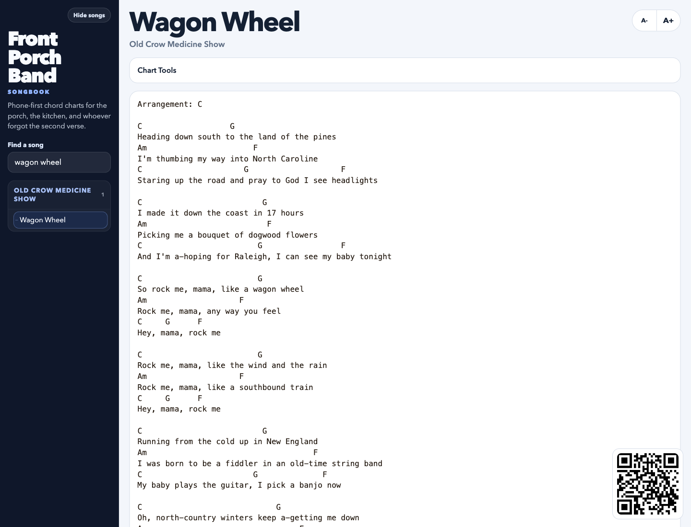

Front Porch Band

Front Porch Band is a static, phone-friendly songbook for jam sessions. It keeps charts readable on mobile, supports per-device transposition and instrument views, and stays easy to host on any static platform.

## Screenshots

Song view:



What it does:

- groups songs by artist in a collapsible sidebar
- keeps charts in monospace, strum-along-friendly layouts
- lets each visitor transpose on their own device
- shows chord diagrams for guitar, mandolin, ukulele, and banjo
- generates a shareable QR code for the current chart
- includes a moderation-only suggestion box for pasted charts
- works as a simple static site with no build step

Why this repo is useful beyond one songbook:

- the app can point at any compatible chart folder
- chart files stay simple and editable
- the generated site is static and cheap to host
- the content pipeline is scriptable and validation-friendly

Quick start

1. Initialize the repo-local private songbook folders.
2. Validate the charts.
3. Sync the generated site data.
4. Open `index.html` locally or deploy the repo as a static site.

```bash
node scripts/setup-private-songbook.mjs
node scripts/validate-charts.mjs
node scripts/sync-charts.mjs
```

By default, the chart scripts prefer `./private-charts` inside the repo. If that folder does not exist, they fall back to the older sibling-folder pattern at `../charts`.

You can also point the app at a different chart directory:

```bash
FRONT_PORCH_CHARTS_DIR=../my-private-charts node scripts/validate-charts.mjs
FRONT_PORCH_CHARTS_DIR=../my-private-charts node scripts/sync-charts.mjs
```

or:

```bash
node scripts/validate-charts.mjs --source ../my-private-charts
node scripts/sync-charts.mjs --source ../my-private-charts
```

Project structure

```text
front-porch-band/
  index.html
  404.html
  app.js
  styles.css
  chord-library.js
  chord-diagrams.js
  approved-charts/      issue-approved source charts committed to the repo
  charts/               generated chart text
  data/songs.json       generated index
  docs/                 project docs
  scripts/              sync, validate, import, and moderation helpers
```

Chart format

Each chart file is a Markdown/plain-text document with a small header:

```text
Song Title

Artist: Artist Name

G            C
First line of the chart
```

See [docs/CHART_FORMAT.md](./docs/CHART_FORMAT.md) for the full format.

Public repo content

This repo is already set up for a public-code / optional-private-library split:

- code license: `MIT`
- public sample content: a tiny `Front Porch Band` sample songbook in `examples/sample-songbook/`
- personal library support: `private-charts/` and `private-build/` stay out of git

If you want a contributor-safe demo build, point the app at the sample set:

```bash
node scripts/validate-charts.mjs --source ./examples/sample-songbook
node scripts/sync-charts.mjs --source ./examples/sample-songbook
```

Importing rough files

If you have rough charts in `.txt`, `.md`, `.docx`, or `.rtf`, there is a scripted import path. See [docs/IMPORTING.md](./docs/IMPORTING.md).

Default import flow:

```bash
node scripts/import-inbox.mjs
node scripts/validate-charts.mjs --source ./private-charts
node scripts/sync-charts.mjs --source ./private-charts
```

Correction inbox

If you want a lightweight “fix this chart” workflow, save a corrected chart into your import inbox using the normal chart format:

```text
Song Title

Artist: Artist Name

G            C
First line of the chart
```

Then run:

```bash
node scripts/apply-import-fixes.mjs
```

That helper will:

- read files from the import inbox
- overwrite the matching existing source chart when it finds one
- regenerate the matching `charts/<slug>.txt`
- update `data/songs.json`
- archive the processed import file

By default in this workspace, it expects:

- inbox: `../import`
- archive: `../import-archive`
- local chart library: `../charts`
- approved repo charts: `./approved-charts`

You can also point it elsewhere with:

```bash
node scripts/apply-import-fixes.mjs --inbox ../import --library ../charts --approved ./approved-charts
```

Deployment

This repo is meant for static hosting.

- local: open `index.html`
- Vercel: point it at the repo root
- any static host: serve the folder as-is

Because the app is hash-routed, `404.html` mirrors `index.html` to make direct links friendlier on static hosts.

GitHub-friendly packaging

If you want the repo to clone cleanly without bundling your real song library:

- keep your personal charts in `./private-charts` or another private folder outside git
- use `node scripts/setup-private-songbook.mjs` once after cloning
- keep `.env` local and out of git
- commit only app code, docs, and any public-safe demo charts

Using this repo for your own personal library

If someone clones the repo and wants to wipe the bundled library right away, they can reset the generated site to their own empty `private-charts` folder:

```bash
node scripts/setup-private-songbook.mjs
node scripts/reset-songbook.mjs
```

That leaves the app intact but rebuilds the song index from `./private-charts` instead of the bundled generated charts.

From there:

```bash
node scripts/import-inbox.mjs
node scripts/validate-charts.mjs
node scripts/sync-charts.mjs
```

They can also point the reset at a different folder:

```bash
node scripts/reset-songbook.mjs --source ../my-private-charts
```

Suggestion inbox

The home screen includes a suggestion box that posts pasted charts to `/api/suggestions` for manual review.

Recommended setup: GitHub Issues

Set these env vars in your host:

```bash
FRONT_PORCH_GITHUB_REPO=owner/repo
FRONT_PORCH_GITHUB_TOKEN=github_pat_or_fine_grained_token
FRONT_PORCH_GITHUB_LABELS=song-suggestion
```

Then each suggestion becomes an open labeled issue in that repo.

Fallback behavior:

- local/self-hosted without GitHub env vars: suggestions are written to `private-build/suggestions`
- custom local path: set `FRONT_PORCH_SUGGESTIONS_DIR=/absolute/path`
- Vercel without GitHub env vars or a durable local directory: submissions fall back to an ephemeral temp folder, which is only useful for testing

Reviewing GitHub suggestions

Use the local GitHub review helper when you want manual moderation from your machine:

```bash
node scripts/review-github-suggestions.mjs list
node scripts/review-github-suggestions.mjs show 123
node scripts/review-github-suggestions.mjs approve 123 --charts ../charts
node scripts/review-github-suggestions.mjs reject 123
```

Web approval flow

If you want to approve from the GitHub web UI instead of the local CLI:

1. open the suggestion issue
2. add the `approved-song` label
3. wait for the `Approve Song Suggestion` GitHub Action to run

That workflow will:

- parse the pasted chart from the issue body
- save a source-style copy under `approved-charts/`
- update `charts/<slug>.txt`
- update `data/songs.json`
- commit the change back to `main`
- comment on the issue and close it

This path is meant for repo-native suggestions only. Your larger private/local chart library can still use the local review CLI when you want finer control.

Local review inbox

If you are running without GitHub issues, there is still a local file-based review helper:

```bash
node scripts/review-suggestions.mjs list
node scripts/review-suggestions.mjs show <filename>
node scripts/review-suggestions.mjs approve <filename> --charts ./private-charts
node scripts/review-suggestions.mjs reject <filename>
```

Contributing

See [CONTRIBUTING.md](./CONTRIBUTING.md).

Publishing

See [docs/PUBLISHING.md](./docs/PUBLISHING.md) for the recommended split between:

- public app code
- private real-world chart libraries
- public sample/demo content

Open-source note

The app code is MIT-licensed and ready to share. Song content is the separate question. If you publish the repo publicly, it is still safer to:

- keep personal or copyrighted charts in a private source folder outside the repo
- include only original songs, public-domain material, or explicit sample/demo charts in the public repository

The public repo currently includes this small sample set for first-time contributors:

- [examples/sample-chart.md](./examples/sample-chart.md)
- [examples/sample-songbook/welcome-to-the-porch.md](./examples/sample-songbook/welcome-to-the-porch.md)
- [examples/sample-songbook/back-porch-forecast.md](./examples/sample-songbook/back-porch-forecast.md)
